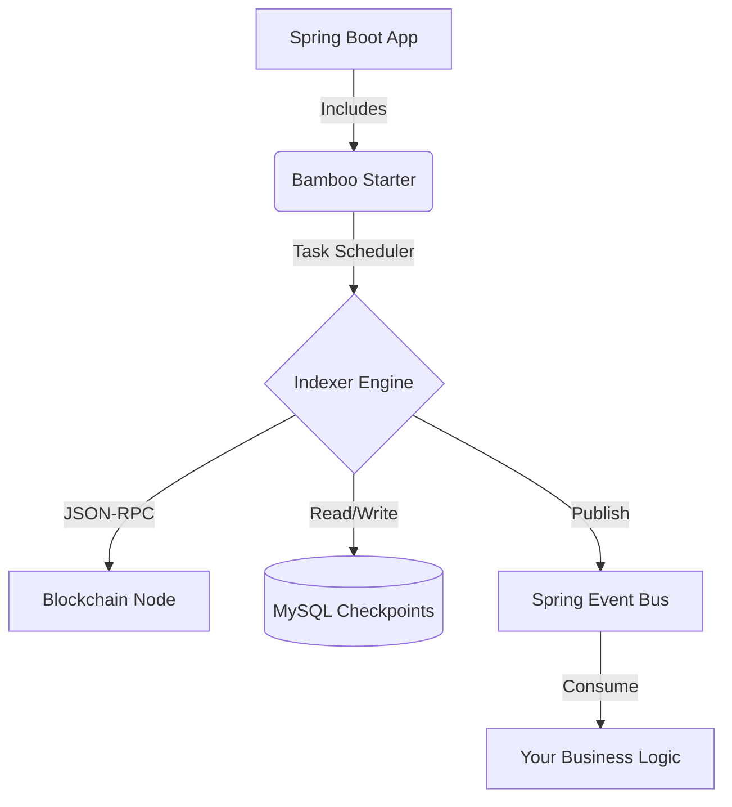

# Architecture

Bamboo is designed as a lightweight, embedded indexer that runs alongside your application logic.

## High-Level Design

## Core Components

### Indexer Task
A single-threaded scheduled task (`IndexerTask`) that runs periodically.
1.  **Reads Checkpoint**: Fetches the last scanned block from the database.
2.  **Fetches Logs**: Calls `eth_getLogs` via Web3j to get events for the configured contracts within the block range (`step-blocks`).
3.  **Persists Data**: Saves raw event logs to the database using JDBC.
4.  **Updates Checkpoint**: Moves the checkpoint forward in a transaction.
5.  **Publishes Events**: Dispatches processed events to the Spring ApplicationEventPublisher.

### Checkpoint Mechanism
Stores the last processed block height for a specific Chain ID. 
- **Table**: `bamboo_checkpoint`
- **Columns**: `chain_id`, `block_height`

### Schema Management
If `bamboo.auto-initialize-schema` is enabled, Bamboo inspects your `contract-event-definitions` and generates SQL DDL to create tables compatible with the event structure.

## Deployment Mode
Bamboo is **stateful** (due to DB checkpoints) but **stateless** in execution run-time.
However, currently, it is recommended to run **only one instance** of the indexer per Chain ID to avoid duplicate scanning or race conditions on the checkpoint.

> [!WARNING]
> The current version does not use distributed locks. Do not scale the indexer instance horizontally for the same chain configuration.
